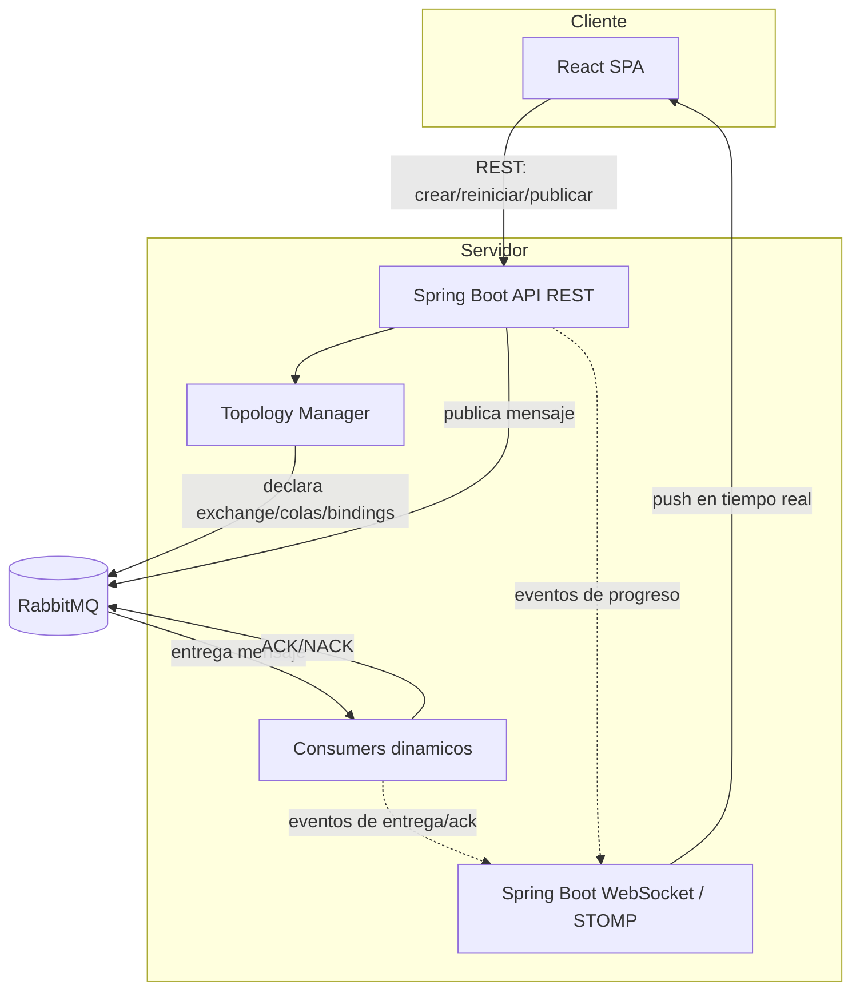
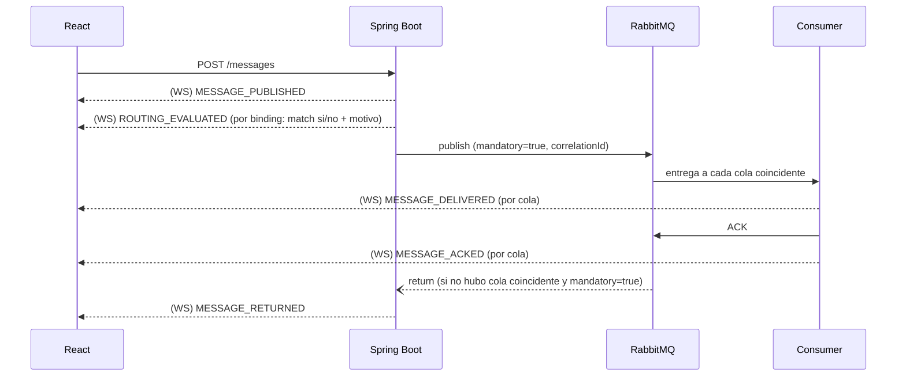

# RabbitMQ Playground — Propuesta de Arquitectura y Diseño

Este documento responde a los 10 puntos solicitados antes de escribir código: arquitectura general, módulos de backend y frontend, modelo de datos, comunicación entre capas, estrategia de infraestructura dinámica, visualización en tiempo real, diseño de pantallas, componentes reutilizables y plan de etapas.

La idea central que atraviesa todo el diseño: el backend no debe *simular* RabbitMQ, debe *usarlo de verdad* (exchanges, colas, bindings y consumidores reales), pero además debe calcular y exponer el razonamiento de enrutamiento (qué bindings matchean y por qué) porque eso es información que el protocolo AMQP no expone por sí solo. La app combina "lo que realmente pasó en el broker" con "la explicación de por qué pasó".

## 1. Arquitectura general



Dos canales de comunicación con propósitos distintos: REST para acciones puntuales (crear escenario, publicar un mensaje, editar bindings) y WebSocket para el flujo continuo de eventos que alimenta la animación. RabbitMQ nunca es tocado directamente por el usuario ni por el frontend; todo pasa por el backend, que es el único dueño de la topología.

## 2. Estructura de módulos del backend (Spring Boot)

```text
backend/
├── config/          RabbitAdmin, ConnectionFactory, WebSocket/STOMP, Jackson
├── scenario/        Modelo de escenario, ciclo de vida (crear/reset/limpiar)
├── topology/        Declaración real de exchanges/colas/bindings vía RabbitAdmin
├── routing/         Evaluadores de enrutamiento (uno por tipo de exchange)
├── messaging/       Publicación de mensajes + consumidores dinámicos
├── events/          Modelo de eventos + broadcaster hacia WebSocket
├── history/         Historial de mensajes por escenario
├── api/             Controllers REST
└── reliability/     (Etapa posterior) DLX, TTL, prefetch, ack manual
```

Responsabilidad de cada módulo, en una línea:

- **scenario**: sabe qué escenarios existen, en qué estado están, y a quién pertenecen (ver sección 6).
- **topology**: es el único módulo que llama a `RabbitAdmin` para crear o borrar exchanges/colas/bindings.
- **routing**: no toca RabbitMQ; replica en Java la lógica de enrutamiento de cada tipo de exchange (Direct = igualdad exacta, Topic = patrón con `*`/`#`, Headers = `x-match all/any`, Fanout = siempre todas, Default = igualdad con nombre de cola) para poder explicar el resultado antes/junto con la entrega real.
- **messaging**: publica con `RabbitTemplate` (con `mandatory=true` y `correlationId`) y administra `SimpleMessageListenerContainer` por cada cola del escenario, con ack manual o automático según configuración.
- **events**: define los tipos de evento (publicado, evaluado, entregado, confirmado, rechazado, devuelto) y los publica a un topic de WebSocket por escenario.
- **history**: guarda en memoria (o en una tabla simple) cada mensaje con su resultado, para el listado histórico.

## 3. Estructura del frontend (React + TypeScript)

```text
src/
├── app/                  Shell, layout, router
├── features/
│   ├── fanout/
│   ├── direct/
│   ├── topic/
│   ├── headers/
│   └── default/
├── components/
│   ├── topology/         Canvas del diagrama + nodos + animación de pulso
│   ├── messaging/        Composer de mensajes + historial + detalle
│   ├── scenario/         Controles Crear/Reiniciar/Limpiar
│   └── explain/          Panel de explicación + badges ✓/✗
├── hooks/                useScenario, useScenarioSocket, useMessageHistory
├── lib/                  Cliente REST, cliente WebSocket, utilidades de animación
└── types/                Tipos TypeScript espejo de los DTOs del backend
```

Cada carpeta bajo `features/` es una pantalla completa (un tipo de exchange) armada combinando los componentes compartidos de `components/`. Esto evita duplicar lógica de canvas, composer o historial entre las cinco secciones: solo cambia la configuración que le pasan a cada componente.

Para el diagrama interactivo se recomienda **React Flow** (liviano, soporta nodos/edges custom, zoom/pan, y es sencillo animar un edge cuando "pasa" un mensaje) en lugar de dibujar SVG a mano.

## 4. Modelo de datos / configuración

**Scenario** (uno por pestaña/sesión de usuario, por tipo de exchange):

| Campo | Descripción |
|---|---|
| `id` | Identificador único del escenario |
| `type` | `FANOUT` \| `DIRECT` \| `TOPIC` \| `HEADERS` \| `DEFAULT` |
| `status` | `CREATED` \| `RUNNING` \| `STOPPED` |
| `exchangeName` | Nombre real declarado en RabbitMQ (o `""` para Default) |
| `queues[]` | Lista de colas con su configuración de binding |
| `createdAt` | Timestamp de creación |

**QueueConfig** (varía según el tipo de exchange):

| Tipo | Configuración de binding |
|---|---|
| Fanout | Sin configuración (binding sin key) |
| Direct | `bindingKey`: string exacta |
| Topic | `pattern`: string con `*` y `#` |
| Headers | `headers`: mapa clave-valor + `xMatch`: `all` \| `any` |
| Default | Implícito: binding key = nombre de la cola |

Además, cada cola tiene atributos comunes reutilizables en etapas posteriores: `durable`, `ackMode` (`manual`/`auto`), `prefetch`, `ttlMs`, `maxLength`, `dlxExchange`.

**MessageEvent** (lo que se guarda en el historial y se envía por WebSocket):

| Campo | Descripción |
|---|---|
| `id`, `scenarioId`, `timestamp` | Identificación |
| `payload`, `routingKey`, `headers` | Lo que envió el usuario |
| `mandatory` | Si se pidió detección de mensajes no enrutados |
| `routingResult[]` | Por cada cola: `{queueName, matched, reason}` — el "por qué" |
| `deliveries[]` | Por cada cola que realmente recibió el mensaje: `{queueName, deliveredAt, ackStatus, ackAt}` |
| `unrouted` | `true` si ninguna cola coincidió |

## 5. Comunicación React ↔ Spring Boot ↔ RabbitMQ

**REST** (acciones puntuales, request/response):

```text
POST   /api/scenarios/{type}          crear escenario (declara exchange/colas/bindings)
POST   /api/scenarios/{id}/reset      purga colas y limpia historial, mantiene topología
DELETE /api/scenarios/{id}            borra bindings, colas y exchange
PUT    /api/scenarios/{id}/bindings   actualiza binding keys / patrones / headers
POST   /api/scenarios/{id}/messages   publica un mensaje
GET    /api/scenarios/{id}/messages   historial paginado
```

**WebSocket** (STOMP sobre SockJS, un topic por escenario: `/topic/scenarios/{id}/events`):

Se elige WebSocket/STOMP por sobre Server-Sent Events porque el modelo de "topics" encaja naturalmente con "un canal de eventos por escenario", permite escalarlo fácilmente a salas por usuario, y deja abierta la puerta a interacción bidireccional futura (por ejemplo, que el usuario controle manualmente el avance de la animación paso a paso).

Secuencia de eventos que viajan por ese canal cuando se publica un mensaje:



## 6. Estrategia para crear y limpiar infraestructura dinámicamente

**Convención de nombres**, para que dos usuarios (o dos pestañas) nunca choquen:

```text
Exchange:  edu.<sessionId>.<tipo>.<sufijo>
Cola:      edu.<sessionId>.<tipo>.q<n>.<etiqueta>
```

`sessionId` es un UUID generado en el navegador la primera vez que se abre la app (guardado en memoria de la pestaña, no en localStorage) y enviado en cada request. Esto aísla completamente los escenarios de cada usuario sin necesidad de login.

**Ciclo de vida**, manejado por `TopologyManager` vía `RabbitAdmin`:

- **Crear**: declara exchange, colas y bindings según la configuración actual; arranca un `SimpleMessageListenerContainer` por cada cola.
- **Reiniciar**: purga las colas (`RabbitAdmin.purgeQueue`) y borra el historial en memoria, sin tocar la topología.
- **Limpiar**: detiene los listener containers, borra bindings, colas y exchange.

**Huérfanos**: si el usuario cierra la pestaña sin presionar "Limpiar", el backend detecta la desconexión del WebSocket y agenda el borrado del escenario tras un período de gracia (por ejemplo, 5 minutos sin reconexión). Adicionalmente, una tarea programada barre y elimina escenarios inactivos más allá de cierto tiempo, como red de seguridad.

## 7. Estrategia para visualizar mensajes en tiempo real

El enrutamiento real dentro de RabbitMQ ocurre en microsegundos, así que si el backend solo reenvía "lo que pasó" sin más, la animación sería instantánea e imposible de seguir. Por eso el backend orquesta la publicación como una pequeña secuencia de eventos discretos, cada uno con un pequeño espaciado (configurable desde la UI con un control de velocidad):

1. `MESSAGE_PUBLISHED` — el mensaje sale del productor.
2. `ROUTING_EVALUATED` — el motor de `routing/` calcula, binding por binding, si coincide y por qué (esto es explicación, no delivery real).
3. Publicación real a RabbitMQ con `correlationId`.
4. `MESSAGE_DELIVERED` por cada cola — emitido por el consumidor real cuando efectivamente recibe el mensaje.
5. `MESSAGE_ACKED` (o `MESSAGE_REJECTED`) — emitido cuando el consumidor real confirma.
6. `MESSAGE_RETURNED` — solo si no hubo ninguna coincidencia y se pidió `mandatory`.

El frontend recibe esta secuencia por WebSocket y la reproduce como una animación: un "pulso" viaja del nodo Productor al nodo Exchange, luego solo por los edges hacia las colas que matchearon (los edges de las que no matchearon se marcan brevemente con una X), y finalmente hacia los consumidores con el badge de ACK. Esto mantiene el diagrama honesto (lo que se anima corresponde a eventos reales del broker) y a la vez pedagógico (con tiempos pensados para que se pueda seguir con la vista).

## 8. Diseño de pantallas

Layout común a las cinco secciones, en tres zonas:

```text
┌─────────────────────────────────────────────────────────┐
│  Explicación breve del tipo de Exchange (2-3 líneas)     │
├───────────────────────────────┬───────────────────────────┤
│                               │  Controles del escenario  │
│      Diagrama de topología   │  (Crear/Reiniciar/Limpiar)│
│      (Producer→Exchange→     │  Composer de mensaje       │
│       Bindings→Queues→       │  Editor de bindings        │
│       Consumers, animado)    │                            │
├───────────────────────────────┴───────────────────────────┤
│  Historial de mensajes (lista expandible por mensaje)     │
└─────────────────────────────────────────────────────────┘
```

Particularidades por sección:

- **Fanout**: el composer incluye un campo de Routing Key marcado como opcional, con una nota fija "esta clave será ignorada". Al enviar, todos los edges hacia las colas se animan al mismo tiempo, para que sea visualmente obvio que no hay filtrado.
- **Direct**: el editor de bindings es una lista simple de pares cola → binding key (texto exacto). El resultado muestra qué cola(s) coincidieron exactamente.
- **Topic**: el editor de bindings acepta patrones con `*` y `#`, con una ayuda visual fija ("`*` = una palabra exacta, `#` = cero o más palabras"). El resultado por mensaje muestra una lista tipo `✓ eu.# coincide` / `✗ us.# no coincide` con el motivo.
- **Headers**: editor dinámico de pares clave-valor tanto para el binding de cada cola como para el mensaje saliente, más un selector `x-match: all/any` por cola. El resultado explica, cabecera por cabecera, cuáles coincidieron.
- **Default**: pantalla más simple, sin editor de bindings (son automáticos e inmutables). El composer solo pide el nombre de cola (que actúa como routing key) y el payload. Incluye una nota explícita sobre el acoplamiento que genera este mecanismo.

## 9. Componentes reutilizables

| Componente | Uso |
|---|---|
| `TopologyCanvas` | Diagrama genérico (Producer/Exchange/Queues/Consumers) que recibe nodos y edges como datos, agnóstico del tipo de exchange |
| `AnimatedPulse` | Punto que viaja por un edge cuando llega un evento de mensaje |
| `MessageComposer` | Formulario de envío, configurable por props (con o sin routing key, con o sin headers) |
| `BindingEditor` | Editor de bindings, con variante `exact` / `pattern` / `headers` |
| `ScenarioControls` | Botones Crear/Reiniciar/Limpiar + badge de estado, igual en las cinco pantallas |
| `ExplanationPanel` | Texto teórico fijo por pantalla |
| `MessageHistoryList` / `MessageDetailCard` | Listado e inspección detallada de mensajes enviados |
| `MatchResultBadge` | Badge ✓/✗ con tooltip explicando el motivo |

## 10. Plan de implementación por etapas

| Etapa | Contenido |
|---|---|
| 0 | Setup: docker-compose con RabbitMQ (+ plugin de management para verificación interna), esqueleto Spring Boot y React |
| 1 | Backend base: `RabbitAdmin`, modelo de Scenario, `TopologyManager` para Fanout y Direct, endpoints REST de creación/publicación, historial en memoria (sin tiempo real todavía) |
| 2 | Capa de tiempo real: WebSocket/STOMP, modelo de eventos, consumidores dinámicos, animación básica funcionando end-to-end para Fanout y Direct |
| 3 | Frontend pulido para Fanout y Direct: `TopologyCanvas` con React Flow, composer, editor de bindings, historial con detalle — validar la experiencia completa con los dos tipos más simples antes de replicar |
| 4 | Topic: evaluador de patrones (`*`/`#`) en el backend + editor de patrones y badges ✓/✗ en el frontend |
| 5 | Headers: evaluador `all`/`any` + editor dinámico de cabeceras |
| 6 | Default: pantalla simplificada, reutilizando la plumbing de Direct (el Default se comporta como un Direct con bindings implícitos) |
| 7 | Confiabilidad básica: ack manual/automático, persistent/durable, `mandatory` + mensajes devueltos, Alternate Exchange |
| 8 | (Opcional, a futuro) Laboratorio de confiabilidad avanzado: TTL, Dead Letter Exchange, prefetch y fair dispatch con múltiples workers, mensajes rechazados |
| 9 | Endurecimiento: barrido de escenarios huérfanos, aislamiento entre sesiones concurrentes, manejo de errores, pulido visual |

La secuencia está pensada para llegar cuanto antes a un ciclo completo funcionando (Etapa 3) con los dos tipos de exchange más simples, y usar eso como plantilla validada antes de invertir en Topic, Headers y Default, que son variaciones sobre la misma base.

---

Quedo a la espera de tu validación sobre este enfoque antes de empezar a escribir código. Si algo no encaja con lo que tenías en mente (por ejemplo, si preferís SSE en vez de WebSocket, o si querés arrancar directamente por Topic en vez de Fanout/Direct), decímelo y ajusto el plan antes de la Etapa 0.
